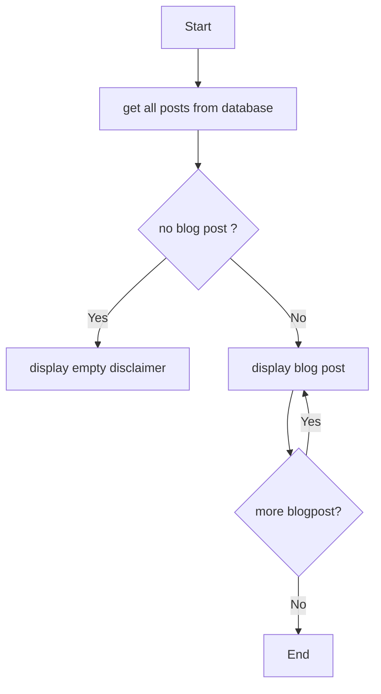
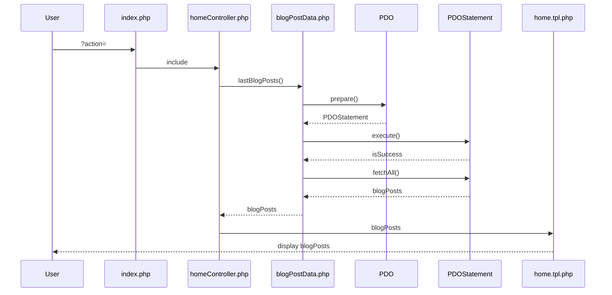
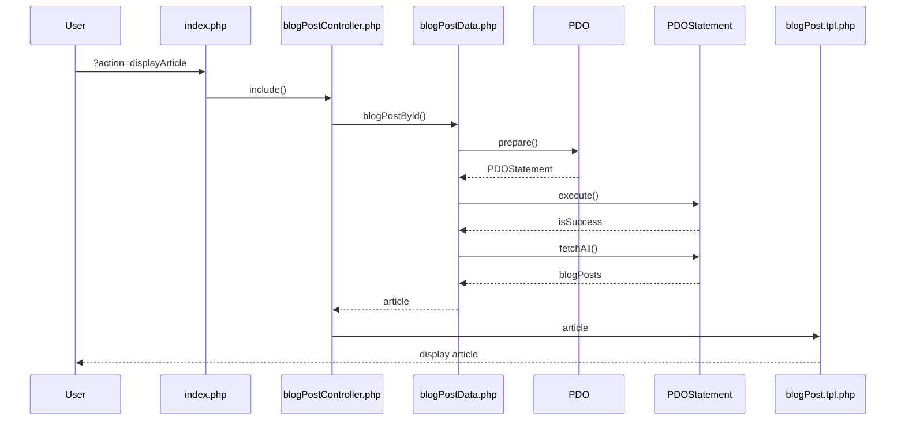
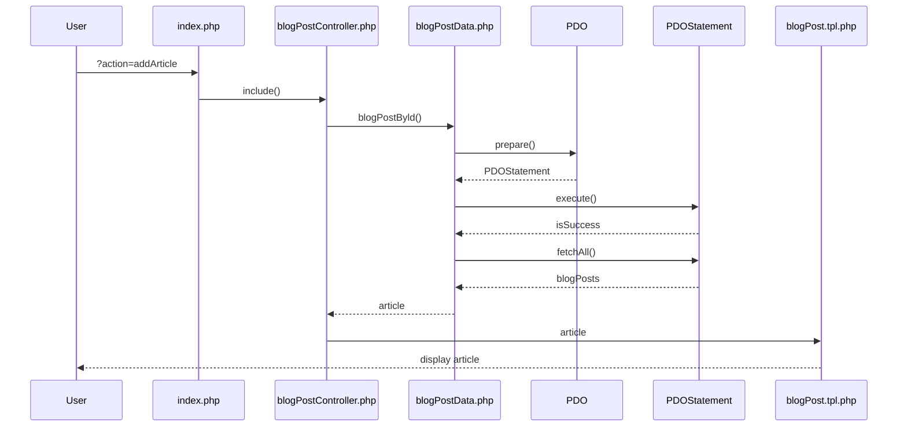

```mermaid
graph TD
A[Start] --> B[get all posts from database]
B --> C{no blog post ?}
C -- Yes --> D[display empty disclaimer]
C -- No --> E[display blog post]
E --> F{more blogpost?}
F -- Yes --> E
F -- No --> G[End]
```

user affiche l'accueil

```mermaid
sequenceDiagram
User ->> index.php: ?action=
index.php->>homeController.php: include
homeController.php->>blogPostData.php: lastBlogPosts()
blogPostData.php->>PDO: prepare()
PDO-->>blogPostData.php: PDOStatement
blogPostData.php->>PDOStatement: execute()
PDOStatement-->>blogPostData.php: isSuccess
blogPostData.php->>PDOStatement: fetchAll()
PDOStatement-->>blogPostData.php: blogPosts
blogPostData.php-->>homeController.php: blogPosts
homeController.php->>home.tpl.php: blogPosts
home.tpl.php-->>User: display blogPosts
```

user affiche un article

```mermaid
sequenceDiagram
User->>index.php: ?action=displayArticle
index.php->>blogPostController.php: include()
blogPostController.php->>blogPostData.php: blogPostByld()
blogPostData.php->>PDO: prepare()
PDO-->>blogPostData.php: PDOStatement
blogPostData.php->>PDOStatement: execute()
PDOStatement-->>blogPostData.php: isSuccess
blogPostData.php->>PDOStatement: fetchAll()
PDOStatement-->>blogPostData.php: blogPosts
blogPostData.php-->>blogPostController.php: article
blogPostController.php->>blogPost.tpl.php: article
blogPost.tpl.php-->>User: display article
```

user ajoute un article

```mermaid
sequenceDiagram
User->>index.php: ?action=addArticle
index.php->>blogPostController.php: include()
blogPostController.php->>blogPostData.php: blogPostByld()
blogPostData.php->>PDO: prepare()
PDO-->>blogPostData.php: PDOStatement
blogPostData.php->>PDOStatement: execute()
PDOStatement-->>blogPostData.php: isSuccess
blogPostData.php->>PDOStatement: fetchAll()
PDOStatement-->>blogPostData.php: blogPosts
blogPostData.php-->>blogPostController.php: article
blogPostController.php->>blogPost.tpl.php: article
blogPost.tpl.php-->>User: display article
```